# Proyecto Final - Docker & Kubernetes

**Alumno:** ARIANA NOEMI CHOQUE HONORIO

**Fecha:** 25 de noviembre del 2025

**Curso:** Docker & Kubernetes - i-Quattro

> **Objetivo** Desarrollar y emplear los conceptos teoricos y practicos abarcados en clase. 

# 📚 Índice

1. [Links de Docker Hub](#links-de-docker-hub)  
2. [Parte 1: Setup del Ambiente](#parte-1-setup-del-ambiente)  
   - [Explicación técnica](#explicación-técnica)  
   - [Problemas encontrados](#problemas-encontrados)  
3. [Parte 2: Backend v2.1](#parte-2-backend-v21)  
   - [Código agregado](#código-agregado)  
   - [Errores y soluciones](#problemas-encontrados-y-resolución)  
4. [Parte 3: Frontend v2.2](#parte-3-frontend-v22)  
5. [Parte 5: Ingress + MetalLB](#parte-5-ingress--metallb)  
6. [Conclusiones](#conclusiones)
   
## Links de Docker Hub
- Backend v2.1: [https://hub.docker.com/r/arinoemi/springboot-api]
- Frontend v2.2: [https://hub.docker.com/r/arinoemi/angular-frontend]

## Parte 1: Setup del Ambiente

**Ambiente utilizado:**
- *Virtualizador:* VirtualBox 
- *Nombre de VM/Instancia:* ariana-choque-k8s
- *Sistema operativo:* Ubuntu 24.04 LTS
- *Recursos:* 4GB RAM, 2 CPU cores
- *Red configurada:* NAT
- *Rango MetalLB:* 192.168.100.200 - 192.268.100.210
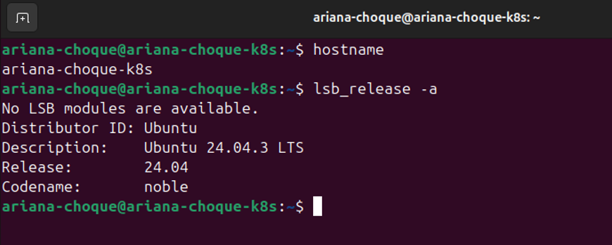

## Explicación técnica
Para montar el entorno de Kubernetes se utilizó **MicroK8s**, ideal por su simplicidad y estabilidad en entornos locales. Se habilitaron:

| Addon | Función |
|-------|---------|
| dns | Resolución DNS interna |
| ingress | Manejo de tráfico HTTP/HTTPS |
| metallb | Asignación de IP para balanceador |

Se configuró MetalLB con un rango IP estático para exponer servicios al exterior (MetalLB es especialmente importante en entornos locales donde no existe un LoadBalancer de nube).   

### ❌ Problemas encontrados
1. Rango IP mal configurado (10.0.2.15) asignado a la maquina virtual → corregido a 192.168.100.200-192.168.100.210.
Esto causó:
- MetalLB no levantaba.
- Los servicios tipo LoadBalancer nunca obtenían IP.
- `kubectl get svc` mostraba `pending`.
- MicroK8s no pudo crear el pool.
**Solución:**  
Modificar el archivo:
```bash
microk8s kubectl edit configmap -n metallb-system config
```
2. Algunos pods tardaron en iniciar → se utilizó `microk8s status --wait-ready` para validar.
3. TLS failed to verify certificate" al hacer port-forward
Error mostrado:
```bash
error upgrading connection: tls: failed to verify certificate:
x509: certificate is valid for 10.0.2.15, ...
```
Causa técnica:
El port-forward usa túneles TLS internos, pero al usar direcciones externas (como la IP del host), Kubernetes detecta que el certificado NO coincide con esa IP.
Solución:
No usar port-forward para servicios expuestos con MetalLB.
En su lugar, acceder vía:
```
http://192.168.100.200
```
### Capturas de pantalla

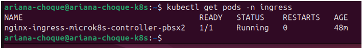
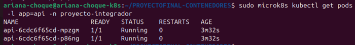
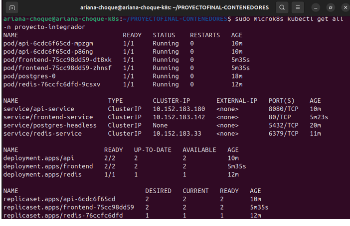
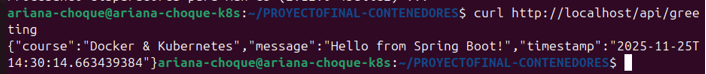
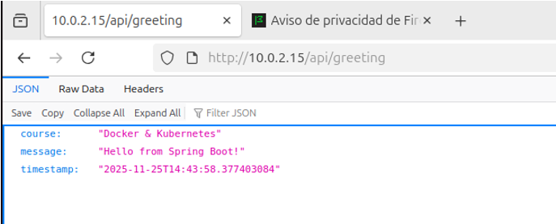
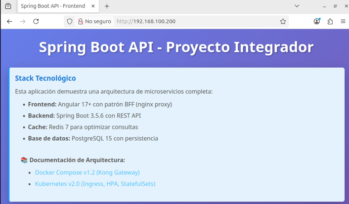

## Parte 2: Backend v2.1
**Descripción de cambios realizados:**  
- Actualización del endpoint `/api/info` para mostrar la información del autor.  
- Subida de la imagen Docker a Docker Hub con versión **v2.1** bajo el usuario `arinoemi`. 
❌ Problemas encontrados y resolución
1. Error de usuario Docker Hub:
Se genero un error con la creacion de la cuenta ariana.choque no existía y generaba duplicidad por lo cual con el uso de logs se pudo identificar y se realizó el cambio → se utilizó arinoemi y se cambió image en deployment.yaml.
```
kubectl rollout restart deployment api -n proyecto-integrador
```
2. Los pods seguían corriendo la versión antigua después de actualizar la imagen
Este fue uno de los errores más comunes:

Aunque actualizabas deployment.yaml, Kubernetes seguía usando la versión anterior del contenedor.

Causa técnica:
El pod ya existía con la versión anterior, y Kubernetes no recrea pods si la versión cambia, a menos que:
- Cambie el tag
- Cambie un hash del spec
- O se haga un rollout manual
Solución:
Forzar el reinicio:
```
kubectl rollout restart deployment api -n proyecto-integrador
```
### Screenshots
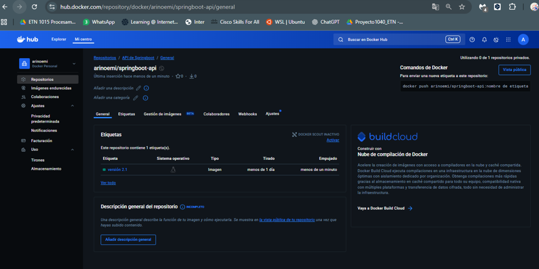
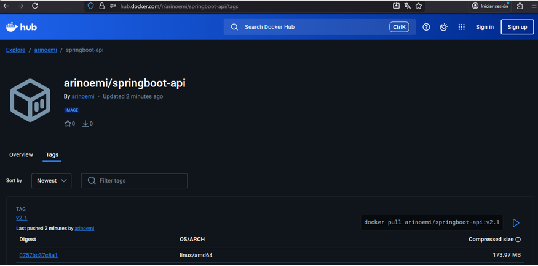
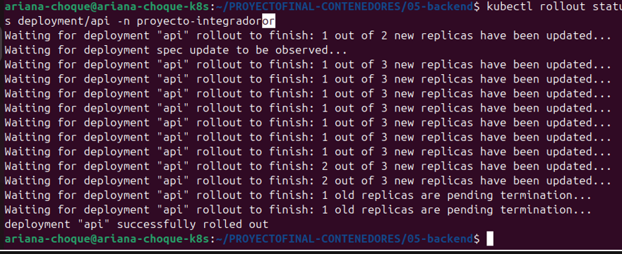
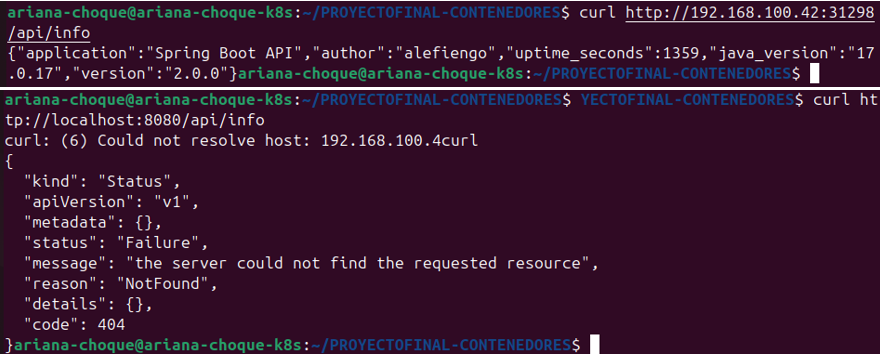
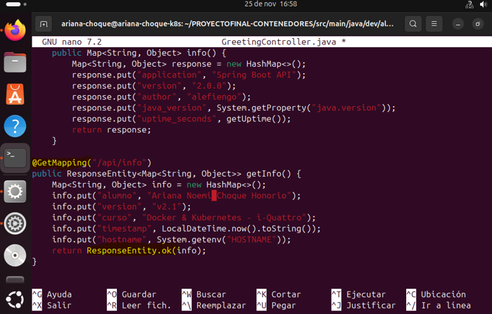

## Parte 3: Frontend v2.2
Descripción de cambios:
- Consumo del endpoint /api/info del backend.
- Visualización de información del sistema en la UI.
- Build final en Docker v2.2.
***Problemas encontrados****
Build sin Internet: Inicialmente la VM no tenía acceso a npm → solucionado configurando NAT y proxy en VirtualBox.

### Screenshots
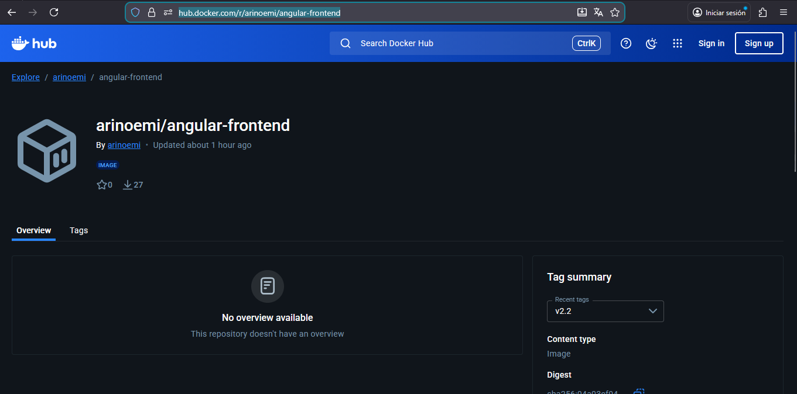
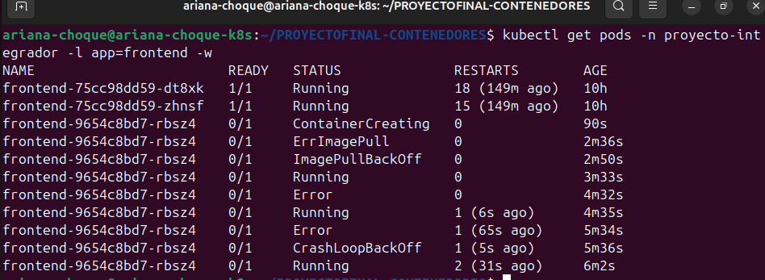
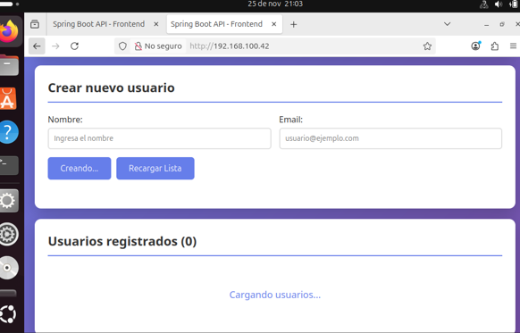


## Parte 5: Ingress + MetalLB

**IP del Ingress:** 192.168.100.200 - 192.268.100.210
***Explicación técnica:***
- Configuración de un recurso Ingress para exponer backend y frontend usando rutas HTTP.
- MetalLB asigna una IP fija para el acceso externo desde cualquier navegador.

***Problemas encontrados***
 - TLS error en port-forward:
```
error upgrading connection: error dialing backend: tls: failed to verify certificate
```
**Solución:** usar la IP de MetalLB para acceso externo en el navegador.
### Screenshots
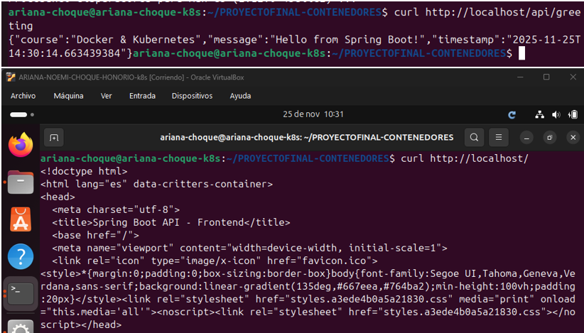
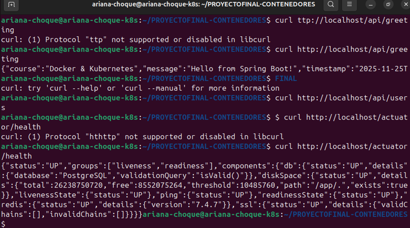
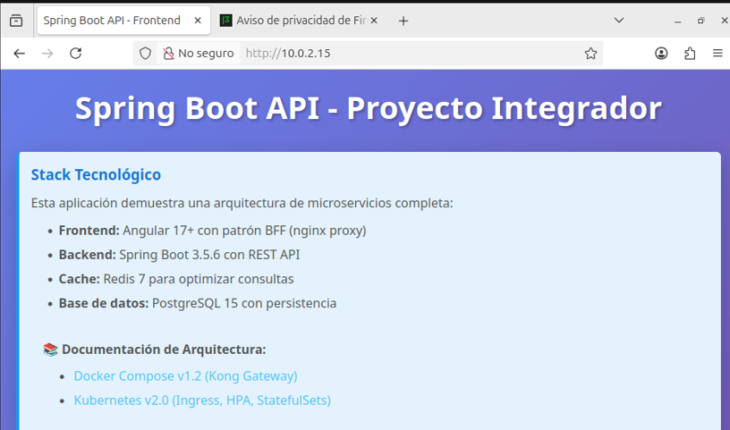
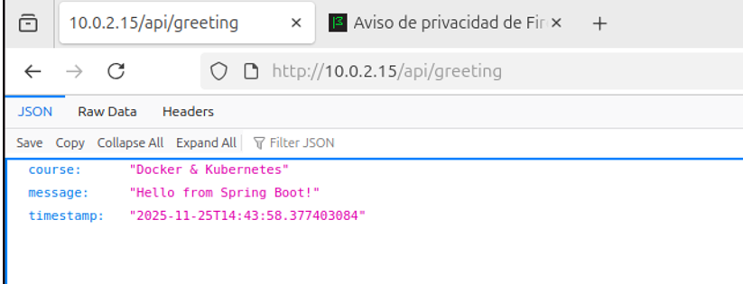
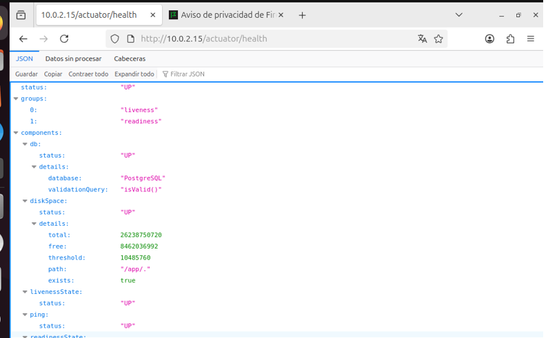
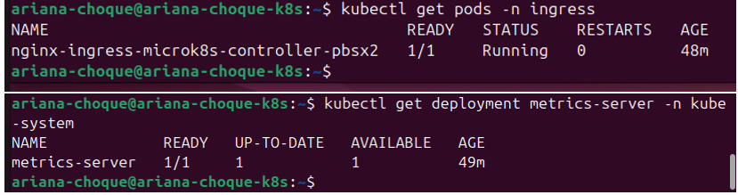
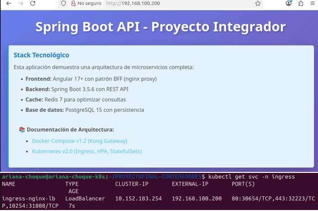

## Conclusiones
- Comprender la interacción entre Docker, Kubernetes y MetalLB.
- Actualización de versiones de imágenes Docker en Kubernetes sin downtime.
- Diagnóstico y resolución de errores frecuentes (usuario Docker Hub, TLS, IP inválida).
### ✔ Aprendizajes principales
1. Diferenciar imágenes locales vs imágenes del registry
Kubernetes NO usa imágenes locales → siempre usa las de Docker Hub.
2. Importancia del manejo de versiones en las imágenes
Si la imagen tiene lleva nombre similar y con el mismo tag, Kubernetes NO la actualiza.
→ Importancia de versionar correctamente.
3. Cómo funciona realmente un Deployment
- Kubernetes mantiene el estado deseado.
- Si no hay cambios en el spec, no recrea pods.
- Rollout es fundamental.
4. Configuración correcta de MetalLB
- No acepta IPs inválidas.
- No funciona si hay conflicto con la red del host.
- Edición de configmaps y verificar estados.
5. Manejo de errores TLS
- Se comprendió por qué falla port-forward cuando el certificado no coincide con la IP.
### Dificultades encontradas
- Configuración de rango IP incorrecto → corregido a 192.168.100.200-192.168.100.210.
- Error de imagen Docker → solución: actualizar deployment.yaml y subir imagen correcta.
- Problemas con port-forward y TLS → solución: acceso vía IP de MetalLB.

### Reflexión
Permite entender cómo desplegar aplicaciones reales, manejar versiones y actualizar servicios sin downtime. Este flujo es esencial para asegurar alta disponibilidad y escalabilidad en proyectos de producción reales.
